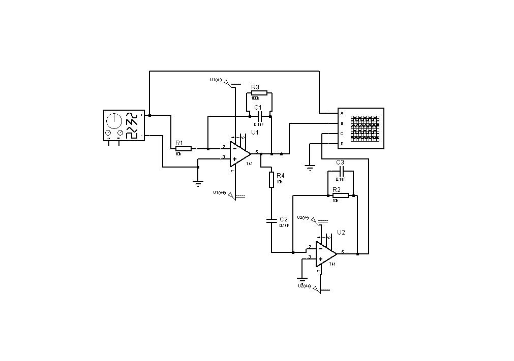

# ⚡ Analog Signal Processing Circuit

  

---

## 📌 What is this project about?

The project implements mathematical operations over signals using a circuit that combines two operational amplifiers in cascade: one configured as an integrator, the other as a differentiator.
It serves as a practical proof for the theoretical concepts of operational amplifiers, allowing us to see their behavior in a real-life setting, observe how certain environment variables can affect the performance of the Op-Amps, and see what design choices can be made to improve them.

---

## 🎯 Objectives

- ⚙️ Prove theoretical concepts with a practical application.

- 🛡️ Work around physical and environmental limitations and interferences.

- 💡 Have a visual representation of the integration and differentiation in real time.

## Components used

- Operational Amplifiers
- Resistors
- Capacitors
- Oscilloscope
- Signal Generator

## System Architecture

Signal Generator

 ↓
 
Analog Processing Circuit

 ↓
 
Oscilloscope Visualization

## Engineering Concepts

- Operational amplifiers
- Frequency response
- Signal transformation
- Data visualization
